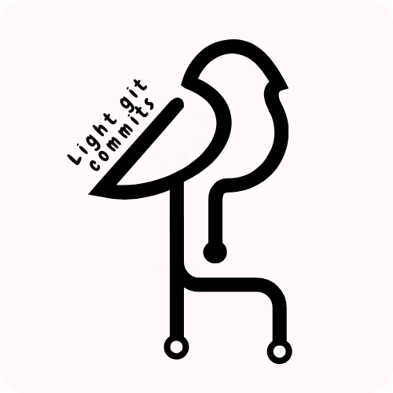

<div align="center">



# Light Git Commits

🪶 Lightweight and extensible conventional commits for lazy perfectionnist. 🥱

</div>

Create light git (conventional) emoji commits with **light-git-commits**. This extension allows you to create, delete, modify or inject lightweight conventional commits. This extension keeps committing **quick**, **light** and **conform**.


[](https://www.conventionalcommits.org/en/v1.0.0/)

## Usage

### Commands

The extension allows 3 commands:

- `Light commit: 🚀 Create a new light (conventional) commit.` to select a template and inject it directy in your **source control inputbox**.
- `Light commit: 📦 Add a new light commit template.` to modify an existing template or create a whole new one.
- `Light commit: 🧹 Delete an existing commit template.` to delete an existing template.

### Source control input completion

The extension introduce a **simple** completion system into to inject **intuitively** your commit messages.
To trigger it, just type `/`, it will show the defined templates.


> **_NOTE:_** This Completion is limited to the Source Control input box.

### Automatic label discovery

You can activate the `labelDiscovery` feature that allows to setup a specific Regexp pattern that will be used to match a `label` directly in your current git branch name. It can be particularly interesting in case you need to track your commits with a ticketing system.

Example:

- branch name: ̀`branch-28-test`
- pattern : `branch-[0-9]+`
- extracted label: `branch-28`
- injected commit message (for a fix commit): `fix: 🐛 (branch-28)`

## Configuration

The settings are accessible in Vscode's `settings.json`. Vscode provide an UI on top of that file to simply the editting of these settings.

### Manually add or delete a new template

> **_WARNING_:** Only if you want to edit the settings manually in `settings.json`.

- You can directly create or delete a new template in the setting : `commitTemplates`.
  The format respect json formatting:

```json
{
  "light-git-commit.commitTemplates": [
    {
      "type": "[string] Your (conventional) commit type",
      "emoji": "[string] Your commit emoji",
      "description": "[string] Your conventional commit description"
    }
  ]
}
```

- You can also show or hide the emojis in the commits.

```json
{
  "light-git-commit.showEmoji": true // or false
}
```

- You can activate or deactivate the label discovery. It is activated by default.

```json
{
  "light-git-commit.activateLabelDiscovery": true // or false
}
```

- You can write your label pattern.

```json
{
  "light-git-commit.labelPattern": "branch-[0-9]+"
}
```

## License

MIT License.
